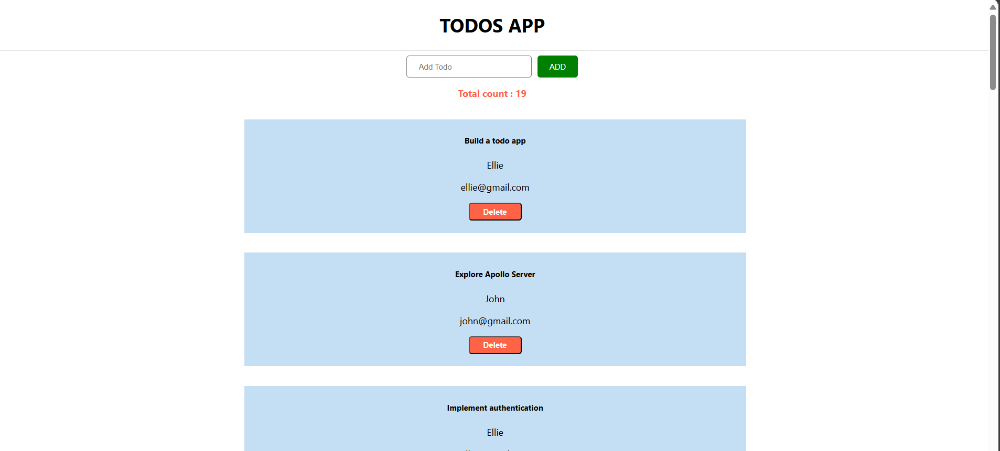

# Getting Started GraphQL

This project was bootstrapped with [Create React App](https://github.com/facebook/create-react-app).

## Available Scripts

In the project directory, you can run:

### COMMANDS TO START

##Backend
1. open terminal: `cd server`
2. `npm install`
3. `npm start`
now your server is running

##Frontend
1. open terminal: `cd client`
2. `npm install`
3. `npm start`
now your server is running

